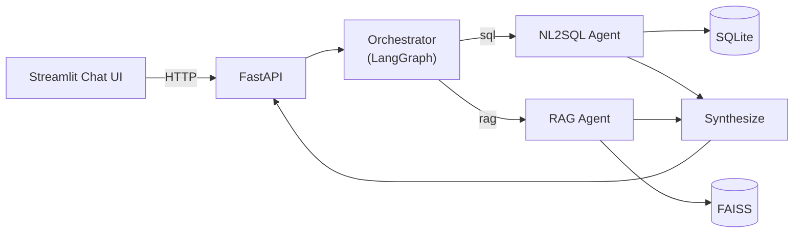

# 🏥 Hospital AI Assistant

A multi-agent AI application that lets hospital staff query **structured
patient/admissions data** and **unstructured hospital policy documents**
through a single natural-language chat interface. An **Orchestrator
Agent**, built as a LangGraph state graph, classifies every incoming
question and routes it to a **NL2SQL Agent** (queries a normalized
SQLite admissions database), a **RAG Agent** (retrieves and cites
hospital policy documents), or both at once for mixed questions.

```
"How many diabetic patients are over 60?"        → NL2SQL Agent
"What is the hospital's visitor policy?"          → RAG Agent
"Which of Dr. Sharma's patients need pre-surgery   → both, merged into
 clearance, and what does clearance require?"        one answer
```

## Why this exists

Real hospital knowledge lives in two very different places: rows in a
database, and paragraphs in policy PDFs. Staff shouldn't need to know
which one to search, or how to write SQL, to get an answer. This project
demonstrates a production-shaped way to bridge that gap: intelligent
routing, a safety-validated NL2SQL pipeline, and a hallucination-guarded
RAG pipeline with real citations — not a demo that only works on the
happy path.

## Architecture at a glance



Full write-up with component-level detail: **[docs/ARCHITECTURE.md](docs/ARCHITECTURE.md)**.
Routing logic in depth: **[docs/ROUTING_LOGIC.md](docs/ROUTING_LOGIC.md)**.
Database design: **[docs/DATABASE_SCHEMA.md](docs/DATABASE_SCHEMA.md)**.
RAG pipeline design: **[docs/RAG_PIPELINE.md](docs/RAG_PIPELINE.md)**.
Trade-offs and what's next: **[docs/DESIGN_DECISIONS.md](docs/DESIGN_DECISIONS.md)**.

## Features

- **Intelligent routing** — LLM-based intent classification (not keyword
  matching) into `sql`, `rag`, `hybrid`, `clarify`, or `unsupported`,
  with a confidence score surfaced in the UI.
- **Safety-validated NL2SQL** — every generated query is parsed into an
  AST (`sqlglot`), checked against a table whitelist, restricted to
  read-only `SELECT`, and capped with an enforced row limit — before it
  ever touches the database. One automatic retry on failure, with the
  specific error fed back to the model.
- **Grounded RAG with citations** — section-aware chunking of policy
  documents, pluggable embeddings (TF-IDF today, sentence-transformers
  one config flag away), a similarity gate that declines rather than
  guesses, and every answer returns the exact document + section it came
  from.
- **Hybrid queries** — questions needing both data and policy are run
  through both agents in parallel and synthesized into one answer.
- **Runs with zero API keys** — every agent has a tested, deterministic
  fallback, clearly labeled as degraded mode, so the full pipeline is
  demonstrable without paid API access. Set an API key to unlock full
  natural-language capability.
- **Conversation memory, query caching, structured logging, a global
  exception handler, and a full pytest suite** (30 tests across the
  validator, both agents, the orchestrator graph, and the API).

## Quickstart

### Option A — local Python

```bash
git clone <this-repo>
cd Hospital-AI
python -m venv .venv && source .venv/bin/activate   # optional but recommended
pip install -r requirements.txt

cp .env.example .env   # optional — fill in an LLM API key to unlock full NL capability

# Loads the CSV into a normalized SQLite DB (also happens automatically on first API boot)
python -m app.database.load_data

# Terminal 1
uvicorn app.api.main:app --reload --port 8000
# Terminal 2
streamlit run frontend/streamlit_app.py
```

Open http://localhost:8501. API docs (Swagger UI) at http://localhost:8000/docs.

### Option B — Docker

```bash
cp .env.example .env   # fill in an API key if you have one
docker compose up --build
```

Backend on `:8000`, frontend on `:8501`.

### Running without an LLM API key

Everything above works with `LLM_PROVIDER=none` (the default). Routing
falls back to keyword heuristics, the SQL agent falls back to a small
library of query templates covering the example questions below, and
the RAG agent returns the most relevant policy section verbatim instead
of a generated summary. Every response is labeled `used_llm: false` in
the API and shown as "rule-based fallback" in the UI, so it's never
mistaken for the primary experience.

To unlock full natural-language capability, set in `.env`:
```
LLM_PROVIDER=anthropic          # or: openai | groq
LLM_MODEL=claude-sonnet-4-6     # or your provider's model name
ANTHROPIC_API_KEY=sk-...
```

## Try it

**Structured data questions (NL2SQL Agent):**
- "How many diabetic patients are older than 60?"
- "What is the average hospital stay for cancer patients?"
- "List all patients assigned to Dr. Smith."
- "How many emergency admissions are there?"

**Policy questions (RAG Agent):**
- "What is the hospital's visitor policy?"
- "What is the procedure for emergency discharge?"
- "Explain the infection control protocol."
- "What documents are required before surgery?"

**Hybrid:**
- "What is the average length of stay for cancer patients, and what
  does the discharge policy say about long stays?"

## Project structure

```
Hospital-AI/
├── app/
│   ├── orchestrator/     # LangGraph StateGraph: classify → route → synthesize
│   ├── sql_agent/        # NL2SQL: schema introspection, prompts, validator, executor
│   ├── rag/               # RAG: loader, chunker, embeddings, FAISS store, agent
│   ├── database/          # SQLAlchemy models + CSV → SQLite ETL
│   ├── llm/                # Provider-agnostic LLM client (Anthropic/OpenAI/Groq)
│   ├── api/                 # FastAPI app, routes, pydantic schemas
│   ├── utils/               # Logging, TTL cache
│   └── config.py             # Environment-driven settings
├── frontend/streamlit_app.py  # Chat UI
├── data/
│   ├── raw/                    # Source CSV
│   ├── processed/               # Generated SQLite DB (gitignored)
│   └── documents/                # 6 synthetic hospital policy docs (markdown)
├── vector_store/                  # Persisted FAISS index (gitignored)
├── tests/                          # 30 tests: validator, agents, orchestrator, API
├── docker/                          # Backend + frontend Dockerfiles
├── docs/                             # Architecture, routing, schema, RAG, design docs
├── notebooks/                         # EDA notebook behind the schema design
├── docker-compose.yml
├── requirements.txt
├── Makefile
└── .env.example
```

## Testing

```bash
pytest --cov=app --cov-report=term-missing
```

30 tests covering: SQL injection/DDL/DML rejection, safe-query passthrough,
NL2SQL fallback correctness against the real loaded dataset, RAG retrieval
precision and citation correctness, orchestrator routing for all five
routes including parallel hybrid execution, and full API integration
tests (health, chat, caching, session clearing).

## Tech stack

Python · FastAPI · LangGraph · SQLAlchemy · SQLite · sqlglot · FAISS ·
scikit-learn (TF-IDF) / sentence-transformers (optional) · Streamlit ·
Anthropic / OpenAI / Groq (pluggable) · pytest · Docker

## License

This is a portfolio/demonstration project built on a public synthetic
dataset. Hospital policy documents included here are entirely synthetic
and written for this project — they do not describe any real
institution's policies.
