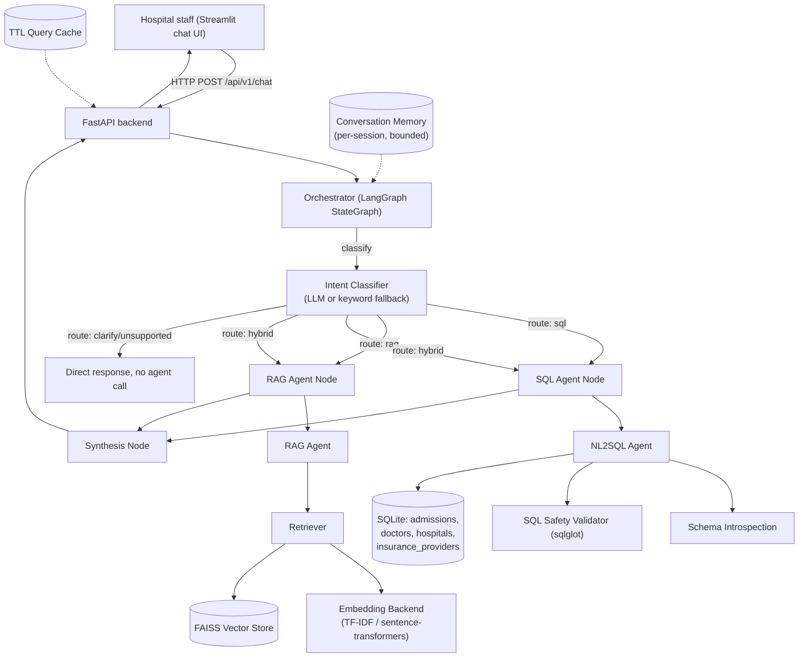

# Architecture

## System overview

## Components

### Orchestrator (`app/orchestrator/`)
A LangGraph `StateGraph` is the actual control-flow engine, not a wrapper
around one. Nodes: `classify -> {sql_node | rag_node | both | clarify |
unsupported} -> synthesize -> END`. `classify` calls the LLM-based intent
classifier (`classifier.py`), which returns a route, a confidence score,
and one-sentence reasoning. A conditional edge fans the state out to
whichever node(s) the route implies -- `hybrid` runs `sql_node` and
`rag_node` as two nodes in the same LangGraph *step*, executed
independently, then both feed into `synthesize`.

`synthesize` merges whatever results exist into one final answer. If both
agents ran, and an LLM is available, a short synthesis call weaves the
data result and the policy result together; otherwise it concatenates
them plainly. This node is also where "handle mixed queries" is actually
implemented -- it's not string concatenation dressed up as intelligence,
it is a real LLM call *only when there is more than one result to
combine*, which keeps latency and cost down for the common single-route
case.

### NL2SQL Agent (`app/sql_agent/`)
Pipeline: `schema_introspection.py` reads the live database (tables,
columns, types, and sampled example values for enum-like columns) and
renders it as compact text -- this is what "analyze the database schema
automatically" means in this codebase: the prompt always describes the
database that is actually running. `prompts.py` builds the NL2SQL prompt
from that schema text. The LLM's raw SQL then passes through
`validator.py`, which parses it with `sqlglot` into an AST and enforces:
single statement, `SELECT`-only, whitelisted tables, and an enforced row
limit (rewritten into the query, not merely requested of the model).
`executor.py` runs the validated SQL and returns typed results.
`agent.py` wires this together and adds one retry: if validation or
execution fails, the specific error is fed back to the LLM once before
giving up.

### RAG Agent (`app/rag/`)
`loader.py` reads the six markdown policy documents. `chunker.py` splits
by document section (`## N. Title`) rather than blind character windows
-- see `docs/RAG_PIPELINE.md` for the reasoning. `embeddings.py` exposes
two interchangeable backends (TF-IDF, sentence-transformers).
`vector_store.py` wraps a FAISS `IndexFlatIP` (cosine similarity via
normalized inner product) with JSON metadata persistence. `retriever.py`
ties loading, chunking, embedding, and indexing into one `build()` /
`retrieve()` interface. `agent.py` gates on a similarity threshold before
even calling the LLM (hallucination prevention layer 1), instructs the
LLM to answer only from retrieved context (layer 2), and returns
structured citations with every answer (layer 3, "show your work").

### Shared state (`app/orchestrator/state.py`)
A single `OrchestratorState` TypedDict flows through every node.
`trace` is `Annotated[list, operator.add]` specifically so that the two
parallel nodes in a `hybrid` route can each append their own trace entry
in the same LangGraph step without conflicting -- LangGraph requires an
explicit reducer for any state key more than one node can write in the
same step; this is the one field that needs it here.

### Memory (`app/orchestrator/memory.py`)
Bounded, in-memory, per-session conversation history, injected into both
the classifier prompt (so "and what about elective ones?" resolves
against the prior turn) and the SQL agent prompt.

### Caching (`app/utils/cache.py`)
A thread-safe TTL+LRU cache keyed on `session_id + normalized question`,
sitting in front of the orchestrator call in the `/chat` route.

### API (`app/api/`)
FastAPI app with a `lifespan` context that runs the CSV ETL on first
boot if the database is empty, builds (or loads a persisted) RAG index,
and constructs one `Orchestrator` instance reused across requests. A
global exception handler logs and returns a generic 500 rather than
leaking stack traces to the client.

### Frontend (`frontend/streamlit_app.py`)
A real HTTP client of the FastAPI backend (not a direct import), with a
route badge per message (SQL / RAG / Hybrid / Clarify), an expandable
"Generated SQL & results" panel, an expandable "Sources" panel with
per-citation relevance scores, example-question quick-start buttons, and
dark-mode-aware CSS.

## Error handling and recovery

- **SQL agent**: a failed validation or execution triggers exactly one
  LLM retry with the specific error appended to the prompt; a second
  failure surfaces a plain-English error instead of a stack trace.
- **RAG agent**: if the top retrieval score is below
  `SIMILARITY_THRESHOLD`, the agent declines rather than asking the LLM
  to answer from irrelevant context.
- **No LLM configured**: every agent has a documented, tested,
  deterministic fallback (rule-based SQL templates; extractive
  "here's the most relevant section" RAG answers; keyword-based
  routing) so the whole system is runnable and demonstrable with zero
  API keys.
- **API layer**: a global FastAPI exception handler catches anything
  unhandled, logs it with a traceback, and returns a generic 500 to the
  client.
